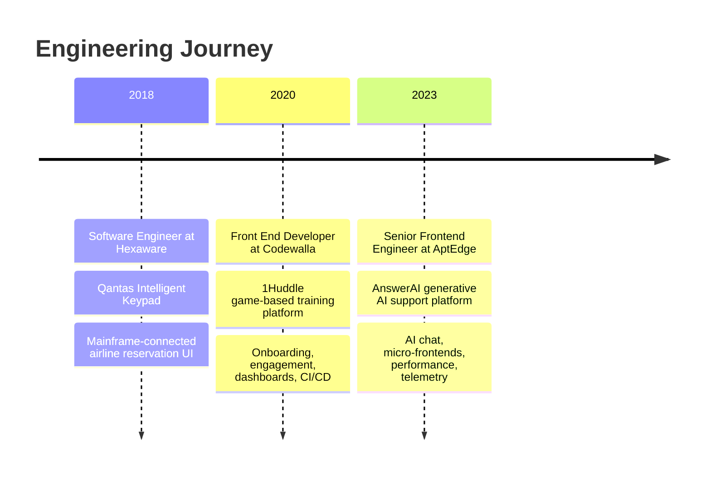

<div align="center">

# Mayuresh Bhagat

### Senior Frontend Engineer • AI Interfaces • React + TypeScript

**8+ years total experience** • **6+ years frontend** • Mumbai, India

  <p>
    <a href="https://linkedin.com/in/mayureshbhagat"></a>
    <a href="mailto:mayureshbhagat0@gmail.com"></a>
    <a href="https://github.com/Mayuresh162"></a>
  </p>

</div>

---

I build product interfaces where **performance**, **architecture**, and **user experience** have to work together under real production pressure. My recent work sits at the intersection of **Generative AI products**, **React/TypeScript architecture**, **token-streaming interfaces**, **micro-frontends**, **rich text systems**, **observability**, and **data-dense enterprise workflows**.

```ts
const mayuresh = {
  focus: "AI interfaces + frontend systems",
  experience: "8+ years total | 6+ years frontend",
  stack: ["React", "TypeScript", "Next.js", "Redux", "Tiptap"],
  edge: [
    "token-streaming chat UX",
    "route-level code splitting",
    "micro-frontends with Yarn Workspaces",
    "virtualized dashboards",
    "testing and telemetry systems"
  ],
  principle: "Make complex workflows feel fast, calm, and obvious."
};
```

---

## AI Frontend Systems

At AptEdge, I worked on **AnswerAI**, a Generative AI-powered answer engine for customer support teams. My frontend work covered real-time token streaming, persistent multi-session chat history, RAG-style interface patterns, Tiptap-powered rich text workflows, telemetry with PostHog, and frontend architecture that could scale across enterprise support platforms.

I like building the layer where engineering craft becomes product clarity: **code splitting that users feel**, **AI responses that stream smoothly**, **dashboards that stay fast with heavy data**, and **editor workflows that make complex knowledge operations simple**.

---

## Measurable Impact

| Area | Result |
| --- | --- |
| Performance | Reduced initial bundle size by **64%**, from **1.56MB to 564KB**, using code splitting and route-level lazy loading. |
| Core Web Vitals | Improved Time to Interactive by **1.8 seconds**. |
| Workflow Efficiency | Reduced Knowledge Base publishing workflow overhead and rendering costs by **80%**. |
| Data-Dense UI | Reduced DOM node inflation by **40%** with virtualized dashboard components. |
| Product Engagement | Helped drive a **45% engagement lift** and **18% competition participation boost**. |
| Quality | Led a TypeScript upgrade that reduced build-time errors by **35%** and cut production runtime crashes to **zero**. |

---

## Experience Journey



---

## Tech I Use

### Frontend Core
<p>
  
</p>

### Architecture, Tooling, Testing
<p>
  
</p>

### Also Worked With
<p>
  
</p>

**Specialized areas:** AI interface design, RAG UI patterns, token streaming UX, Tiptap editor extensions, PostHog telemetry, SonarQube, Yarn Workspaces, React Testing Library, Jasmine, Karma.

---

## Featured Work

### AI Notebook

A full-stack AI application built around **RAG-based workflows**.

- Built a responsive frontend for live token-streaming responses and real-time operational feedback.
- Created modular ingestion flows for PDFs, web articles, YouTube videos, and raw text.
- Integrated OpenAI and Groq-powered response orchestration.
- Solved frontend consistency issues around embedding dimension mismatches during dynamic model switching.
- Deployed production-ready builds through Vercel and GitHub.

---

## Engineering Style

> I like frontend work that has teeth: fast interfaces, hard product constraints, clean architecture, and enough polish that users never notice how much complexity is underneath.

I care about shipping interfaces that stay fast as the product grows, making complex workflows feel calm and predictable, writing TypeScript that makes future changes less risky, turning product analytics into better engineering decisions, and mentoring developers through patterns, context, and readable code.

---

## GitHub Pulse

<div align="center">
  
  
</div>

<div align="center">
  
</div>

---

## Connect

<p align="center">
  <a href="https://twitter.com/mayureshbhagat5"></a>
  <a href="https://linkedin.com/in/mayureshbhagat"></a>
  <a href="https://www.hackerrank.com/mayureshbhagat0"></a>
  <a href="https://www.leetcode.com/mayureshbhagat0"></a>
</p>
